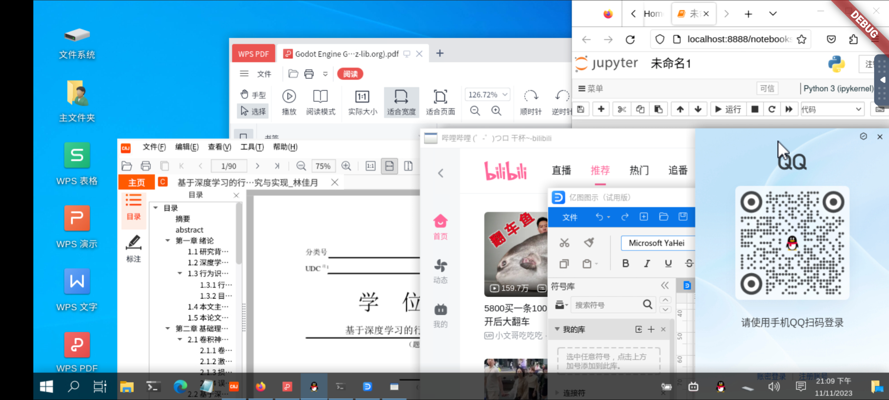
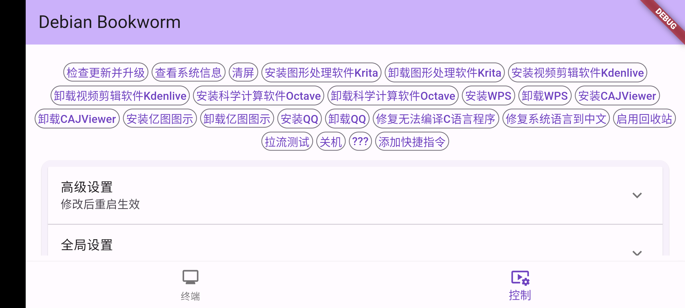
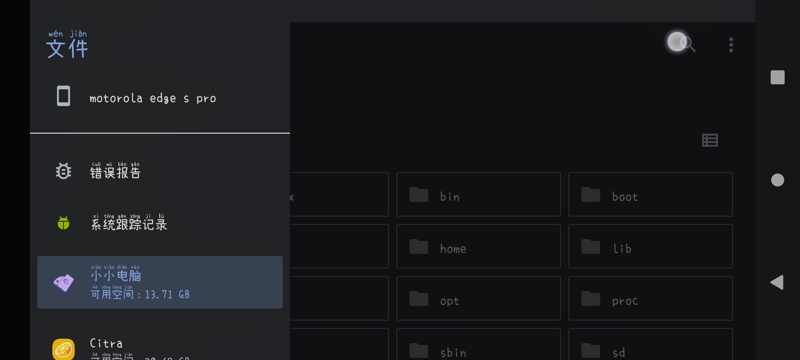
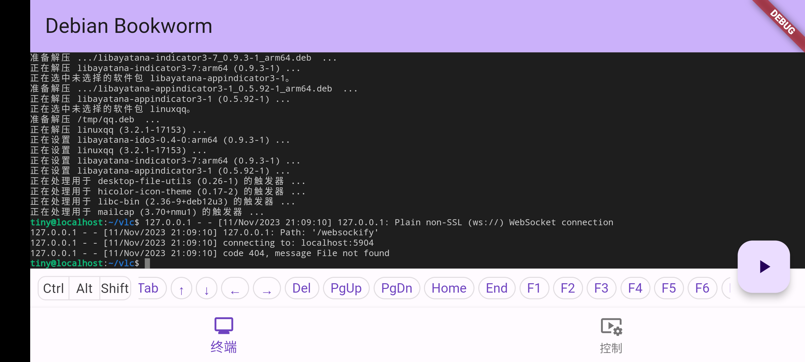

<p align="center"></img></p>

# Tiny Computer

A "PC application engine" alternative for all Android arm64 devices. You can install PC-level software such as WPS, CAJ Viewer, and EdrawMax on Tiny Computer.

Click-to-run Debian Bookworm XFCE/LXQt/... on Android for Chinese users, with the Fcitx Pinyin input method preinstalled. No Termux is required. If you want to change the language in the container, run "tmoe", since this root filesystem is made using [tmoe](https://github.com/2moe/tmoe).

## Features

- One-click installation, ready to use out of the box
- Win10 theme from kali-undercover (XFCE version only), friendly interface



- Provides one-click installation commands for commonly used software



- Easily change screen scaling, no need to worry about the screen being too large or too small


- Conveniently access device files, or access software files through the device's SAF



- Provides a terminal and many adjustable parameters for advanced users



## Download

Tiny Computer offers multiple versions. To use Tiny Computer as a PC application engine, please download and install the [XFCE](https://xfce.org/) version (tiny-computer-xfce.apk) from the [Releases](https://github.com/Cateners/tiny_computer/releases) page.

If you encounter a black screen issue, please uninstall and try the [LXQt](https://lxqt-project.org/) version (look for tiny-computer-lxqt.apk on the Releases page).

The difference between these versions lies in the desktop environment. You can simply understand it as the interface being different, but the functionality is basically the same.

LXQt interface example:


If you are downloading Tiny Computer to experience more desktop environments and enjoy the fun of tinkering with Linux, here are some other versions available for download!

A version in collaboration with the [GXDE](https://www.gxde.org/) team [#129](https://github.com/Cateners/tiny_computer/issues/129). It can be downloaded [here](https://mirrors.sdu.edu.cn/spark-store-repository/GXDE-OS/APK/). GXDE interface example:


A version provided by the [Lingmo Desktop](https://www.lingmo.org/) developer [#218](https://github.com/Cateners/tiny_computer/issues/218). Lingmo Desktop interface [example](https://www.bilibili.com/video/BV1Ci421R7AR)

## Principle

Uses proot to run the Debian environment.

Built-in [noVNC](https://github.com/novnc/noVNC)/[AVNC](https://github.com/gujjwal00/avnc)/[Termux:X11](https://github.com/termux/termux-x11) to display the graphical interface.

## Project Structure

Information about the source of files in assets can be found [here](extra/readme.md).

The complete container creation process can be seen [here](extra/build-tiny-rootfs.md).

Data packages are no longer updated in assets but are provided with releases, mainly to prevent git from becoming increasingly large.

lib directory:

- main.dart file, page layout, a bit messy
- workflow.dart file, logic part, currently still understandable
  - Util utility class
  - TermPty a terminal
  - G global variable class
  - Workflow all steps from opening the software to starting the container

## Compilation

You need to have Flutter and Android SDK configured, and also install python3, bison, patch, gcc, then clone this project.

Before compiling, you need to download patch.tar.gz from releases and copy it to assets; also download the system rootfs (or [make it yourself](extra/build-tiny-rootfs.md)), then use the split command to segment it and copy it to assets. I usually split it into 98MB.

`split -b 98M debian.tar.xz`

You also need to modify some default configurations of Flutter because they conflict with some settings in the project's build.gradle.
- Comment out or delete the `if` code block related to `ShrinkResources` in the `flutter\packages\flutter_tools\gradle\src\main\groovy\flutter.groovy` path.
```groovy
            // if (shouldShrinkResources(project)) {
            //     release {
            //         // Enables code shrinking, obfuscation, and optimization for only
            //         // your project's release build type.
            //         minifyEnabled(true)
            //         // Enables resource shrinking, which is performed by the Android Gradle plugin.
            //         // The resource shrinker can't be used for libraries.
            //         shrinkResources(isBuiltAsApp(project))
            //         // Fallback to `android/app/proguard-rules.pro`.
            //         // This way, custom Proguard rules can be configured as needed.
            //         proguardFiles(project.android.getDefaultProguardFile("proguard-android-optimize.txt"), flutterProguardRules, "proguard-rules.pro")
            //     }
            // }
```

Then you can compile. The command I use is as follows:

`flutter build apk --target-platform android-arm64 --split-per-abi --obfuscate  --split-debug-info=tiny_computer/sdi`

Some C code may report errors. For example, files like KeyBind.c may report some symbols as undefined. But in fact, the functions containing those symbols are not used, so you can delete them and compile again.
There should be compilation options to avoid this situation, but I'm not familiar with cmake, so I'll leave it like this for now :P

## Currently Known Bugs

Cannot sudo in multi-user/clone scenarios, other issues see issues.

## Some Links

This is my first Flutter software, thanks to these projects for guiding me

- Requires some basics [《Flutter实战·第二版》](https://book.flutterchina.club) (Flutter in Action, 2nd Edition)
- Maybe a zero-based Flutter video course [freeCodeCamp Flutter Course](https://www.youtube.com/watch?v=wFn-m-OgKPU&list=PL6yRaaP0WPkVtoeNIGqILtRAgd3h2CNpT)

- VS Code on Android [Code FA](https://github.com/nightmare-space/vscode_for_android)

## Getting Started

This project is a starting point for a Flutter application.

A few resources to get you started if this is your first Flutter project:

- [Lab: Write your first Flutter app](https://docs.flutter.dev/get-started/codelab)
- [Cookbook: Useful Flutter samples](https://docs.flutter.dev/cookbook)

For help getting started with Flutter development, view the
[online documentation](https://docs.flutter.dev/), which offers tutorials,
samples, guidance on mobile development, and a full API reference.
